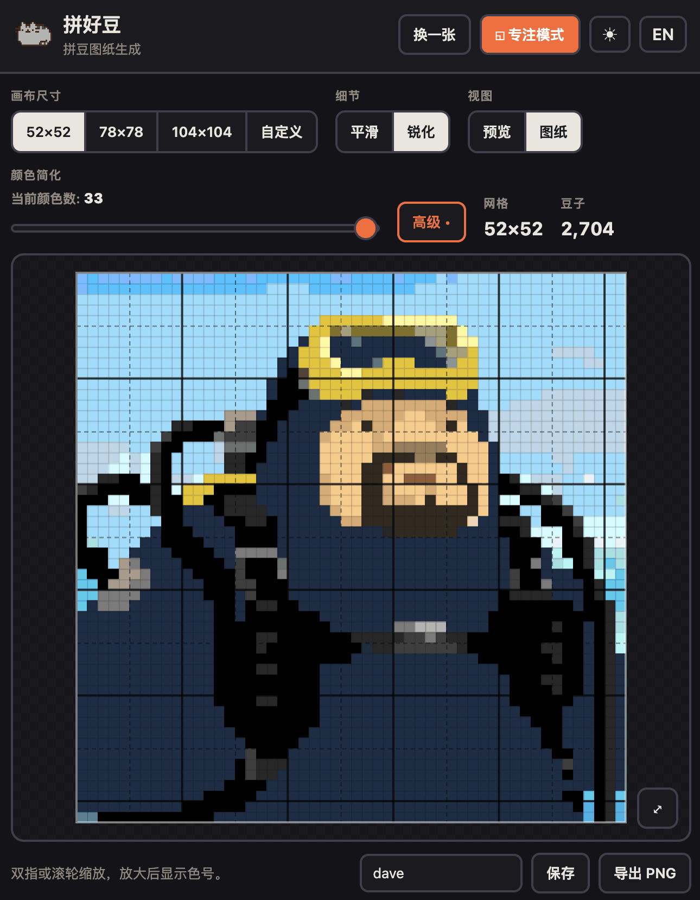
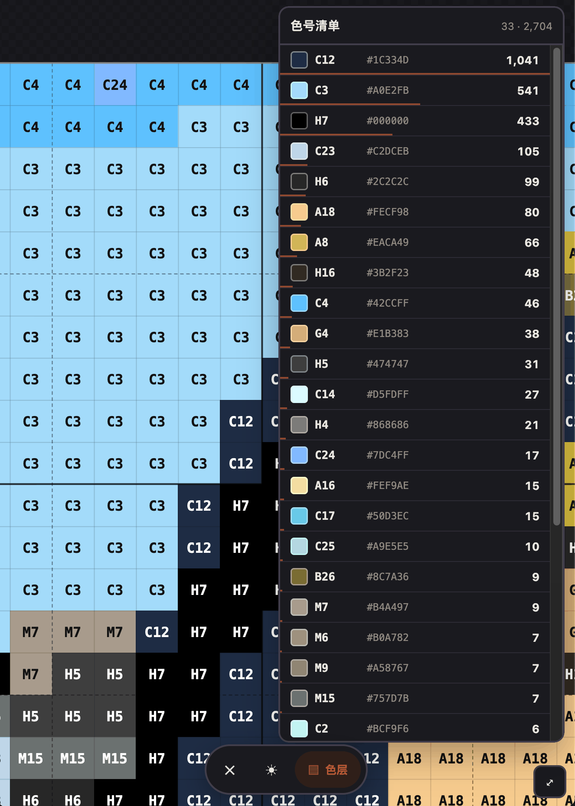

# 拼好豆 · 拼豆图纸生成

Turns an image into a pixel-bead (拼豆 / perler) chart using the **Mard standard palette** (221 stocked colours),
and shows it as a zoomable grid where every cell carries its bead code.

## Try it

### → [pindou.anthonyylq.workers.dev](https://pindou.anthonyylq.workers.dev)

|                                                       Design mode                                                       |                                                         Working mode                                                         |
| :----------------------------------------------------------------------------------------------------------------------: | :---------------------------------------------------------------------------------------------------------------------------: |
|  |  |
|                                                  Setting up the canvas.                                                  |                                      **专注模式 / Focus** view for while you are working                                      |

## How to use

1. **Upload** any image (PNG, JPG, WebP, GIF).
2. **Pick a canvas** — 52×52, 78×78, 104×104, or any custom square from 16 to 200 beads. The
   image keeps its aspect ratio and fills the canvas as far as it can.
3. **Simplify colors** — To avoid having too many distinct colors which is a pain in arse.
4. **Read the chart** — pan and zoom (pinch on a phone), codes appear as you zoom in,
   with dashed gridlines every 5 cells and solid ones every 10 so you can count your place.
5. Select `Focus` to enter working mode, where you can filter by color.
6. **Save** — projects are kept in this browser, and can be exported to a file you control.

Light and dark themes, English and Chinese, and built mobile-first.
